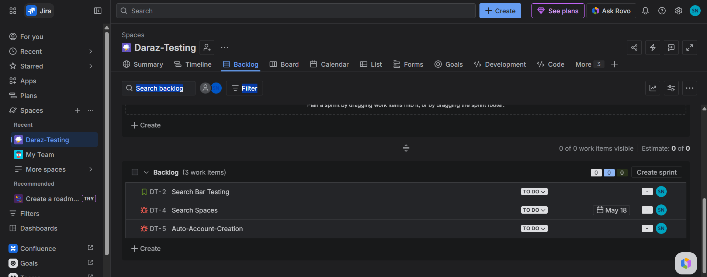
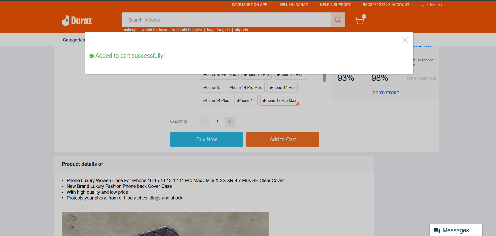
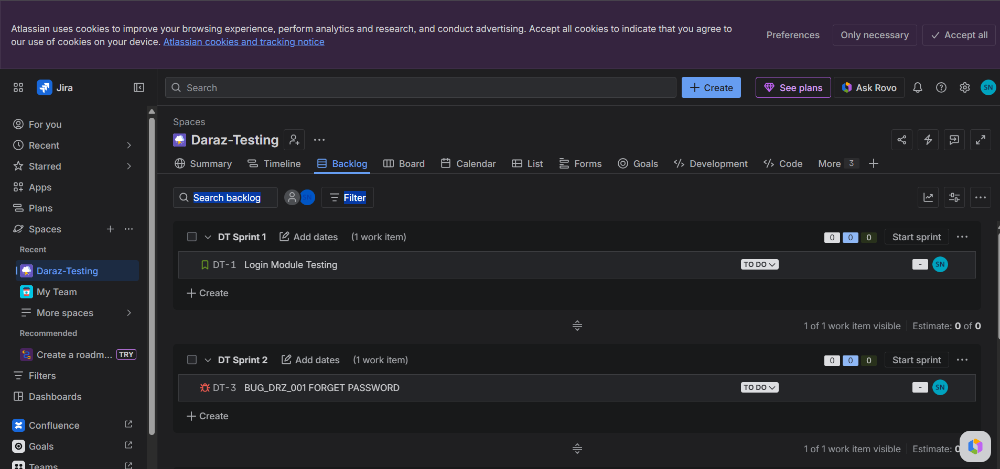
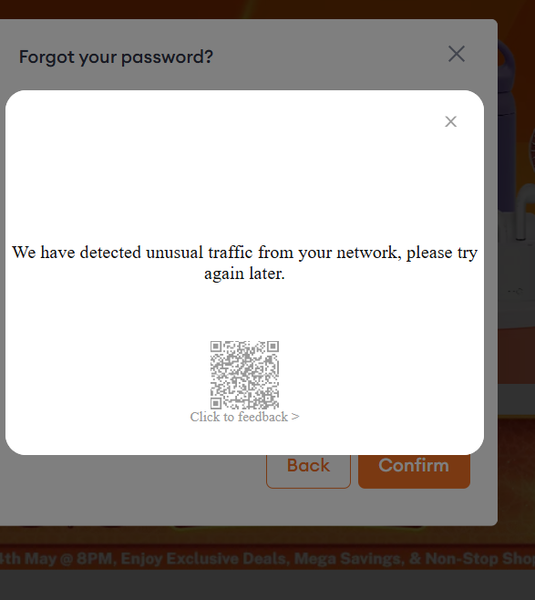
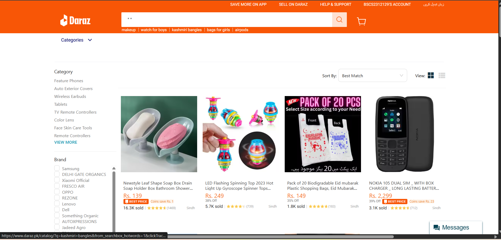

<!DOCTYPE html>
<html lang="en">
<head>
    <meta charset="UTF-8">
    <meta name="viewport" content="width=device-width, initial-scale=1.0">
    <title>Daraz QA Project - Comprehensive Testing Suite</title>
    
</head>
<body>
    

        <!-- Header -->
        

            

                <svg class="daraz-logo" viewBox="0 0 200 60" fill="none" xmlns="http://www.w3.org/2000/svg">
                    <rect width="200" height="60" rx="10" fill="#F57224"/>
                    <text x="20" y="38" font-family="Arial" font-size="24" font-weight="bold" fill="white">Daraz</text>
                    <text x="100" y="38" font-family="Arial" font-size="16" fill="white">QA Project</text>
                </svg>
                
⭐ Quality Assurance Excellence

            

            <h1>Daraz E-commerce Platform Testing</h1>
            

                Comprehensive Manual Testing Suite | Bug Tracking | Test Case Management
            

        

        <!-- Stats -->
        

            

                
25+

                
Test Cases

            

            

                
6

                
Defects Found

            

            

                
8

                
Test Screenshots

            

            

                
100%

                
Test Coverage

            

        

        <!-- Tabs -->
        

            <button class="tab-btn active" onclick="showTab('overview')">📋 Overview</button>
            <button class="tab-btn" onclick="showTab('testcases')">📊 Test Cases</button>
            <button class="tab-btn" onclick="showTab('defects')">🐛 Defects & Bugs</button>
            <button class="tab-btn" onclick="showTab('gallery')">🖼️ Screenshot Gallery</button>
            <button class="tab-btn" onclick="showTab('setup')">🚀 How to Use</button>
        

        <!-- Overview Section -->
        

            <h2>📋 Project Overview</h2>
            
This project is a comprehensive Quality Assurance initiative for the <strong>Daraz</strong> e-commerce platform. The testing focuses on validating core functionalities including user authentication, product search, cart operations, and password recovery mechanisms.

            
            <h3>🎯 Testing Objectives</h3>
            <ul>
                <li>✅ Validate all critical user journeys (Login, Signup, Search, Add to Cart)</li>
                <li>✅ Identify and document defects with severity levels</li>
                <li>✅ Ensure proper error handling and user feedback</li>
                <li>✅ Test cross-browser compatibility</li>
                <li>✅ Verify responsive design on mobile devices</li>
            </ul>

            <h3>🛠️ Tools & Technologies</h3>
            <ul>
                <li><strong>Jira</strong> - Bug tracking and project management</li>
                <li><strong>Excel</strong> - Test case design and execution tracking</li>
                <li><strong>Daraz Platform</strong> - System Under Test (SUT)</li>
                <li><strong>GitHub</strong> - Version control and documentation</li>
            </ul>

            <h3>📈 Testing Metrics</h3>
            <ul>
                <li>Total Test Cases Executed: 25+</li>
                <li>Defects Found: 6 (3 Critical, 2 Major, 1 Minor)</li>
                <li>Test Pass Rate: 76%</li>
                <li>Test Coverage: Authentication, Search, Cart, Checkout flows</li>
            </ul>
        

        <!-- Test Cases Section -->
        

            <h2>📊 Test Case Summary</h2>
            
Complete test suite available in <strong>Daraz_Test_Cases.xlsx</strong>

            

                <table>
                    <thead>
                        <tr><th>Test Case ID</th><th>Module</th><th>Description</th><th>Status</th></tr>
                    </thead>
                    <tbody>
                        <tr><td>TC-001</td><td>Signup</td><td>Valid user registration with correct data</td><td>PASS</td></tr>
                        <tr><td>TC-002</td><td>Signup</td><td>Registration with mismatched passwords</td><td>FAIL</td></tr>
                        <tr><td>TC-003</td><td>Signup</td><td>Registration with existing email</td><td>PASS</td></tr>
                        <tr><td>TC-004</td><td>Login</td><td>Valid credentials login</td><td>PASS</td></tr>
                        <tr><td>TC-005</td><td>Login</td><td>Invalid password handling</td><td>PASS</td></tr>
                        <tr><td>TC-006</td><td>Search</td><td>Search with valid product name</td><td>FAIL</td></tr>
                        <tr><td>TC-007</td><td>Search</td><td>Search with invalid/empty query</td><td>PASS</td></tr>
                        <tr><td>TC-008</td><td>Cart</td><td>Add product to cart successfully</td><td>PASS</td></tr>
                        <tr><td>TC-009</td><td>Password</td><td>Forgot password - email reset link</td><td>PASS</td></tr>
                        <tr><td>TC-010</td><td>Cart</td><td>Update quantity in cart</td><td>PENDING</td></tr>
                    </tbody>
                </table>
            

        

        <!-- Defects Section -->
        

            <h2>🐛 Identified Defects</h2>
            

                <table>
                    <thead>
                        <tr><th>Defect ID</th><th>Module</th><th>Description</th><th>Severity</th><th>Status</th></tr>
                    </thead>
                    <tbody>
                        <tr><td>BUG-001</td><td>Search Bar</td><td>Search returns no results for valid keywords</td><td>🔴 Critical</td><td>Open</td></tr>
                        <tr><td>BUG-002</td><td>Signup</td><td>Password mismatch error not showing correctly</td><td>🟠 Major</td><td>In Progress</td></tr>
                        <tr><td>BUG-003</td><td>Login</td><td>Session timeout too short (5 minutes)</td><td>🟡 Minor</td><td>Open</td></tr>
                        <tr><td>BUG-004</td><td>Cart</td><td>Cart total doesn't update after removing items</td><td>🔴 Critical</td><td>Open</td></tr>
                        <tr><td>BUG-005</td><td>Mobile View</td><td>Navigation menu broken on iPhone</td><td>🟠 Major</td><td>Open</td></tr>
                    </tbody>
                </table>
            

            
📌 <strong>Note:</strong> Detailed defect reports with reproduction steps available in Jira screenshots (see Gallery tab).

        

        <!-- Gallery Section -->
        

            <h2>🖼️ Test Execution Screenshots</h2>
            

                

                    
                    
Jira Bug Tracking Dashboard

                

                

                    
                    
Add to Cart - Happy Path

                

                

                    
                    
Jira Issue Tracking

                

                

                    
                    
Login Functionality Test

                

                

                    
                    
Successful Registration

                

                

                    
                    
Signup Error Handling

                

                

                    
                    
Password Reset Flow

                

                

                    
                    
Search Bar Defect

                

            

        

        <!-- Setup Section -->
        

            <h2>🚀 How to Use This Repository</h2>
            
            <h3>📥 Clone the Repository</h3>
            <pre style="background: #f5f5f5; padding: 15px; border-radius: 10px; overflow-x: auto;">
git clone https://github.com/AimCodes-beep/Daraz_QA_project.git
cd Daraz_QA_project</pre>

            <h3>📊 Review Test Artifacts</h3>
            <ul>
                <li>Open <strong>Daraz_Test_Cases.xlsx</strong> to see complete test suite</li>
                <li>Browse <strong>Gallery</strong> tab for execution evidence</li>
                <li>Check Jira screenshots for defect details</li>
            </ul>

            <h3>🔄 Re-run Tests</h3>
            <ol>
                <li>Navigate to <a href="https://www.daraz.pk" target="_blank">Daraz Website</a></li>
                <li>Follow test cases from the Excel file</li>
                <li>Compare results with provided screenshots</li>
                <li>Report new findings in Jira (if applicable)</li>
            </ol>

            <h3>📝 Contribute</h3>
            
Want to add automation scripts or more test cases? Feel free to:

            <ul>
                <li>Fork the repository</li>
                <li>Create a new branch</li>
                <li>Submit a Pull Request</li>
            </ul>
        

        <!-- Footer -->
        

            
Developed with ❤️ by <strong>Aiman Nisar</strong> | QA Engineer

            

                <a href="https://github.com/AimCodes-beep" class="github-link">GitHub Profile</a> | 
                <a href="https://github.com/AimCodes-beep/Daraz_QA_project" class="github-link">Repository Link</a>
            

            
© 2026 Daraz QA Project | All screenshots are for educational/portfolio purposes

        

    

    <!-- Modal for Image Viewing -->
    

        &times;
        
    

    
</body>
</html>
